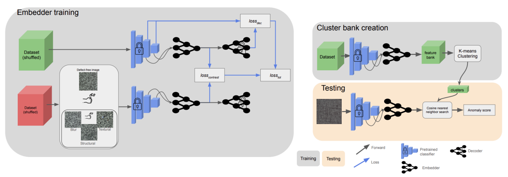

<p align="center">
  <h1><center> CSE </center></h1>
</p>

## Official implementation of the paper : "CSE: Surface Anomaly Detection with Contrastively Selected Embedding"
Article : https://arxiv.org/pdf/2403.01859.pdf


<p align="center">
  
</p>


## Getting Started

You will need [Python 3.10+](https://www.python.org/downloads) and the packages specified in _requirements.txt_.

Install packages with:

```
$ pip install -r requirements.txt
```

## Configure and Run
To run the code, please download the MVTEC AD dataset and place it in dataset/MVTEC  
Link to download the dataset : https://www.mvtec.com/company/research/datasets/mvtec-ad 

To run train and test the model : 
```
python trainCSE.py 
```
To modify the object categories or hyperparameters, you can modify the config.yaml file.

## Citation
Please cite our paper in your publications if it helps your research. Even if it does not, you are welcome to cite us.

        @inproceedings {thomine2024cse,
        title={CSE: Surface Anomaly Detection with Contrastively Selected Embedding},
        author={Thomine, Simon and Snoussi, Hichem},
        booktitle={2024 International Conference on Computer Vision Theory and Applications (VISAPP 2024)},
        year={2024}
        }

## License

This project is licensed under the MIT License.